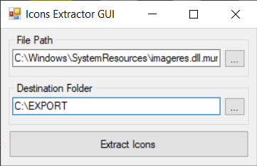

# Icons extractor
Extract all icons from specific exe or dll.

## Usage
There are 2 applications. 1st is command line 2nd is GUI.

The reason to make this is because I couldn't find any software that could extract more than 1 icon from file.

```dos
IconsExtractor.exe <filePath> <outputPath>
```

## Idea for GUI
It works by using System.Reflection to load the assembly and execute the method in another executable.

## Screenshot

